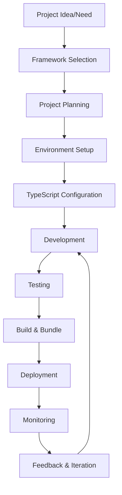
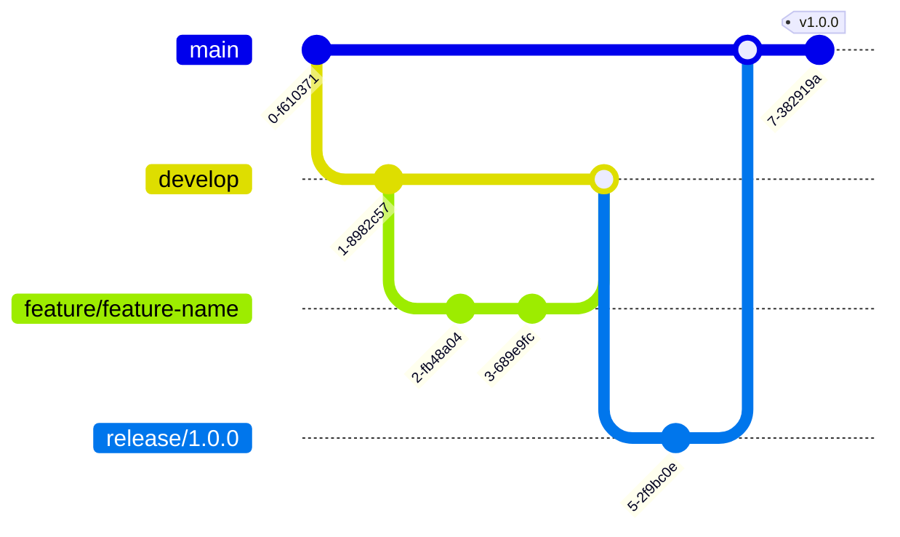
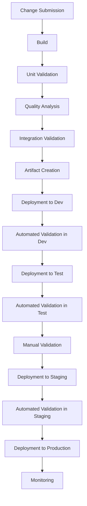

# Node-TypeScript Creation Process

## Purpose
This document outlines the creation process for Node.js TypeScript projects, including workflows, standards, and best practices specific to the Node.js ecosystem.

## Classification
- **Domain:** Process
- **Stability:** Semi-stable
- **Abstraction:** Structural
- **Confidence:** Established

## Content

### Node-TypeScript Creation Workflow

Node.js TypeScript projects follow this specialized workflow:



### Work Environments

#### Local Development Environment

Node.js TypeScript development environment setup and configuration.

**Prerequisites:**
- Node.js (LTS version recommended)
- npm, yarn, or pnpm package manager
- TypeScript compiler (global or project-local)
- Code editor with TypeScript support (VS Code recommended)
- Git for version control

**Setup Instructions:**
1. Install Node.js from nodejs.org or using a version manager (nvm/fnm)
2. Choose and install a package manager (npm comes with Node.js)
3. Install TypeScript: `npm install -g typescript` or use project-local installation
4. Set up IDE with TypeScript extensions and Node.js debugging support
5. Configure Git with appropriate .gitignore for Node.js projects

**Working Locally:**
```bash
# Navigate to app directory
cd app/

# Initialize Node.js project (if not done)
npm init -y

# Install TypeScript and development dependencies
npm install -D typescript @types/node ts-node nodemon

# Create TypeScript configuration
npx tsc --init

# Install project dependencies
npm install

# Start development server
npm run dev
```

#### Collaborative Environment

[Describe the shared collaborative environment]

**Access:**
[Instructions for accessing the collaborative environment]

**Usage Guidelines:**
[Guidelines for using the collaborative environment]

#### Validation Environment

[Describe the validation environment]

**Access:**
[Instructions for accessing the validation environment]

**Usage Guidelines:**
[Guidelines for using the validation environment]

#### Pre-release Environment

[Describe the pre-release environment]

**Access:**
[Instructions for accessing the pre-release environment]

**Usage Guidelines:**
[Guidelines for using the pre-release environment]

#### Release Environment

[Describe the release environment]

**Access:**
[Instructions for accessing the release environment]

**Usage Guidelines:**
[Guidelines for using the release environment]

### Creation Process Steps

#### 1. Framework Selection & Planning

**Activities:**
- Evaluate Node.js framework options (Express, Fastify, Next.js, NestJS, etc.)
- Document framework selection decision using decision template
- Define project architecture and structure
- Plan TypeScript configuration strategy
- Identify required dependencies and tooling

**Outputs:**
- Framework selection decision record
- Project architecture document
- Technology stack definition
- Development environment requirements

**Tools:**
- Node-TypeScript framework decision template
- Architecture decision records (ADRs)
- Context network documentation

#### 2. Environment Setup & Configuration

**Activities:**
- Initialize Node.js project in app/ directory
- Configure TypeScript compiler settings
- Set up package.json with scripts and dependencies
- Configure development tooling (ESLint, Prettier, etc.)
- Set up testing framework and configuration

**Outputs:**
- Configured package.json
- TypeScript configuration (tsconfig.json)
- Linting and formatting configuration
- Testing setup and configuration
- Development scripts and workflows

**Tools:**
- npm/yarn/pnpm package managers
- TypeScript compiler (tsc)
- ESLint and Prettier
- Jest/Vitest testing frameworks
- VS Code or preferred IDE

#### 3. Development & Implementation

**Activities:**
- Implement core application structure
- Develop features following TypeScript best practices
- Write unit and integration tests
- Document API interfaces and components
- Follow established coding standards

**Outputs:**
- TypeScript source code
- Test suites (unit and integration)
- API documentation
- Component documentation
- Type definitions

**Tools:**
- TypeScript compiler and language server
- Testing frameworks (Jest, Vitest, Mocha)
- API documentation tools (Swagger, TypeDoc)
- Code quality tools (ESLint, SonarQube)

#### 4. Code Review & Quality Assurance

**Activities:**
- Conduct peer code reviews
- Run automated quality checks
- Verify TypeScript type safety
- Check test coverage and quality
- Validate adherence to coding standards

**Outputs:**
- Code review feedback and approvals
- Quality metrics reports
- Type safety verification
- Test coverage reports
- Compliance verification

**Tools:**
- Git pull request workflows
- GitHub/GitLab code review tools
- TypeScript compiler strict mode
- Coverage tools (nyc, c8)
- Code quality analyzers

#### 5. Integration

**Activities:**
- [Activity 1]
- [Activity 2]
- [Activity 3]

**Outputs:**
- [Output 1]
- [Output 2]
- [Output 3]

**Tools:**
- [Tool 1]
- [Tool 2]
- [Tool 3]

#### 6. Delivery

**Activities:**
- [Activity 1]
- [Activity 2]
- [Activity 3]

**Outputs:**
- [Output 1]
- [Output 2]
- [Output 3]

**Tools:**
- [Tool 1]
- [Tool 2]
- [Tool 3]

#### 7. Feedback

**Activities:**
- [Activity 1]
- [Activity 2]
- [Activity 3]

**Outputs:**
- [Output 1]
- [Output 2]
- [Output 3]

**Tools:**
- [Tool 1]
- [Tool 2]
- [Tool 3]

### Quality Standards

[Describe the quality standards for the project]

#### General Guidelines

- [Guideline 1]
- [Guideline 2]
- [Guideline 3]

#### Domain-Specific Guidelines

**[Domain 1]:**
- [Guideline 1]
- [Guideline 2]
- [Guideline 3]

**[Domain 2]:**
- [Guideline 1]
- [Guideline 2]
- [Guideline 3]

### Version Control

#### Versioning Strategy

[Describe the versioning strategy for the project]



#### Change Tracking Guidelines

[Describe the guidelines for tracking changes]

#### Review Process

[Describe the process for reviewing and approving changes]

### Validation Strategy

[Describe the validation strategy for the project]

#### Unit Validation

[Describe the approach to validating individual units of work]

#### Integration Validation

[Describe the approach to validating integrated components]

#### Comprehensive Validation

[Describe the approach to comprehensive validation]

#### Performance Validation

[Describe the approach to performance validation]

### Documentation

[Describe the documentation requirements and processes]

#### Work Documentation

[Describe the requirements for documenting the work]

#### Interface Documentation

[Describe the requirements for documenting interfaces]

#### User Documentation

[Describe the requirements for user documentation]

### Continuous Integration/Continuous Delivery

[Describe the CI/CD pipeline for the project]



## Relationships
- **Parent Nodes:** [foundation/principles.md]
- **Child Nodes:** 
  - [processes/validation.md]
  - [processes/delivery.md]
- **Related Nodes:** 
  - [planning/roadmap.md] - implements - Creation process implements roadmap items
  - [foundation/structure.md] - follows - Creation follows structural guidelines

## Navigation Guidance
- **Access Context:** Use this document when onboarding new team members or when needing to understand or follow the creation process
- **Common Next Steps:** After reviewing the creation process, typically explore specific aspects like validation or delivery
- **Related Tasks:** Element creation, issue resolution, review, validation
- **Update Patterns:** This document should be updated when creation processes change or are refined

## Metadata
- **Created:** [Date]
- **Last Updated:** [Date]
- **Updated By:** [Role/Agent]

## Change History
- [Date]: Initial creation of creation process document
